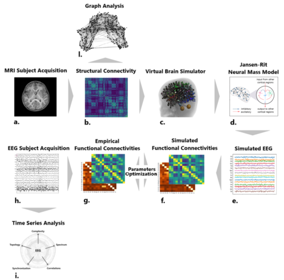

# thesisProject_ASDreplica

## Network Model Reproduces Personalized Brain Dynamics in Autism Spectrum Disorder

This repository contains the codes I've written and used for my thesis work 'Network Model Reproduces Personalized Brain Dynamics in Autism Spectrum Disorder'. 
The overall pipeline includes integrating different methods for analyzing EEG and structural connectivity data and the simulation and optimization process of the personalized brain network model.

## Contents

-  pipeline of multimodal analysis for EEG data (h.>I.) [EEG_analysis.ipynb]
        
-  pipeline of structural connectivity analysis (b.>l.) [SC_analysis.ipynb]

-  pipeline of simulation of the brain network model in the virtual brain framework (b.>c.>d.>e.) [Brain_network_model.ipynb]

-  pipeline of optimization process and feature importance (h.>g.<>f.<e.) [Multi_Objective_Optimization.ipynb]

  The codes were written in Python integrating the Virtual Brain Framework and several libraries in a unified frame.

## Data
  The EEG and MRI datasets of the two subjects used in this study have been acquired at the IRCCS Stella Maris Foundation under the clinical supervision of Dr. E. Bartolini and Dr. S. Calderoni, and shared, after anonymization, for research purposes within a scientific collaboration between the Sant’Anna School of Advanced Studies and the Stella Maris Institute.
  I preprocessed the EEG data with standard techniques with the EEGLAB toolbox following Makoto's preprocessing Pipeline (https://sccn.ucsd.edu/wiki/Makoto%27s_preprocessing_pipeline).
  Structural data used as input for the brain network model were extracted from the MRI data by Michelangelo Fabbrizzi.
  
  
## Usage
The material can be cloned for other purposes or consulted.
If you find an issue or would like to improve, please submit an issue using the issues tab above. 

## Known issues (work in progress)
This repository is still ongoing. The material is going to be integrated into a global framework for a coming publication, including the MRI tractography pipeline (a.>b.), developed by Michelangelo Fabrizzi.
