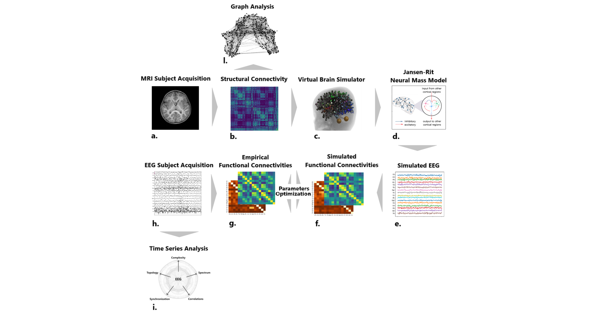

# thesisProject_ASDreplica

## Network Model Reproduces Personalized Brain Dynamics in Autism Spectrum Disorder

This repository contains the codes written and used for my thesis work ' Network Model Reproduces Personalized Brain Dynamics in Autism Spectrum Disorder'. 
The overall pipeline includes integrating different methods for analyzing EEG data and structural connectivity data and the simulation and optimization process of the personalized brain network model.

...

## Contents

-  pipeline of multimodal analysis for EEG data (h.>i.)
        
-  pipeline of structural connectivity analysis (b.>l.)

-  simulation of brain network model in the virtual brain framework (b.>c.>d.>e.)

-  pipeline of optimization process and feature importance (h.>g.<>f.<e.)

  Code was written modularly and subsequently integrated into a global framework. In particular, a pipeline for the MRI preprocessing and connectivity extraction from advanced tractography techniques (a>b), not reported here, was developed by Michelangelo Fabbrizzi producing connectivity input used in the simulation pipeline. 

## Usage

The material can be used for

